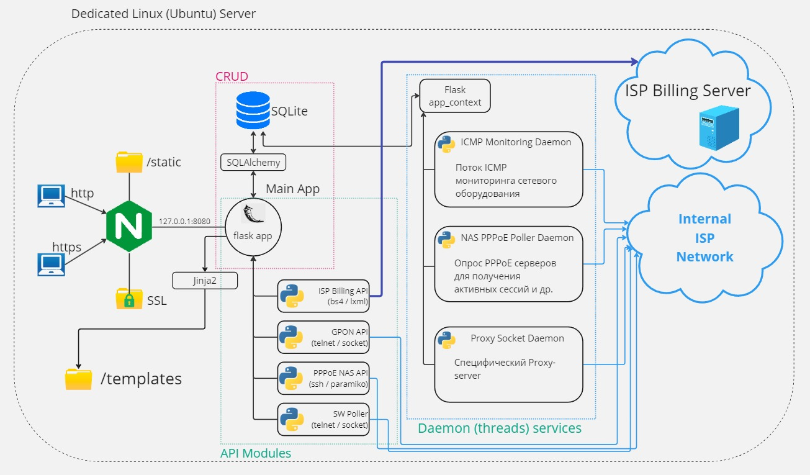

# ISP Monitoring System (Flask)

### Краткое описание проекта:

Данная система построена на веб-фреймворке Flask,архитектура монолитная. 
Так как БД в данном проекте не сильно нагружается запросами, за основу была взята SQLite. 
Система ICMP-мониторинга была реализована в виде daemon-потока 
Другие системы и утилиты были реализованы так же, в виде daemon-потоков

### Цели проекта:

* Упростить для работников (операторов, техников, монтажников, сисадминов) использование ресурсов провайдера
* Централизованно мониторить состояние узлов, серверов
* Превратить не дружелюбные для техников и монтажников CLI интерфейсы в графические интерфесы (JS, HTML, CSS)
* Автоматизация рутинных процессов (например регистрация ONT Gpon терминалов)
* Создание системы поиска по логину из Billing системы, откуда физически клиент работает (порт сетевого коммутатора)
* Центральное хранилище конфигураций, прошивок сетевого оборудования
* Более удобная система helpdesk и дополнитеных заявок в отличии от существующей в провайдере

### Основные библиотеки и фреймворки проекта

or just [jump to the conclusion](#func)

### Database
 

### Static files, ssl, proxy

### Простая схема архитектуры проекта

### Основные представления (views) проекта

* [Главная страница / Dashboard](#dash-bord)
* [Мониторинг / ICMP](#icmp)
* [Поиск по логину / Search Port](#search)
* [Заявки на ремонт / HelpDesk](#helpdesk)
* [Заявки на подключение / ConnectStatements](#stmts)
* [Интерфейс / GPON](#gpon)
* [Хранение конфигов / ConfigStorage](#config)
* [Список клиентов / BillingViewer](#carbon)
* [Админ панель / SimpleAdminPanel](#admin)

<h2 id="dash-bord">Dashboard</h2>

<h2 id="icmp">ICMP</h2>

<h2 id="search">Search Port</h2>

<h2 id="helpdesk">HelpDesk</h2>

<h2 id="stmts">ConnectStatements</h2>

<h2 id="gpon">GPON GUI</h2>

<h2 id="config">Config Storage</h2>

<h2 id="carbon">Carbon</h2>

<h2 id="admin">Admin Panel</h2>

